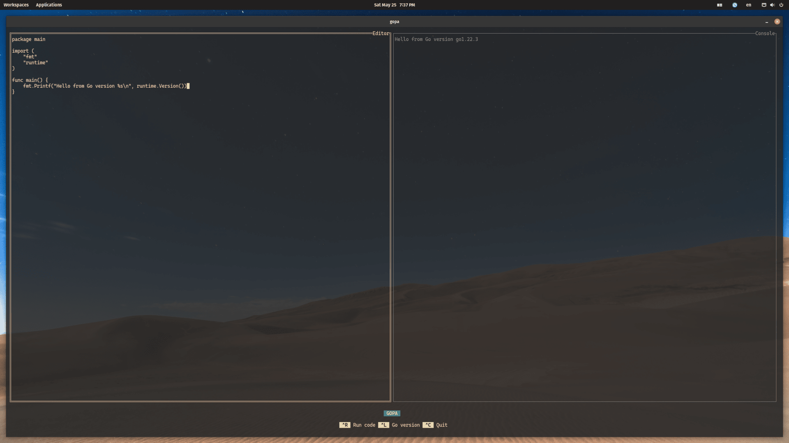

# Gopa

Gopa is a free (as in speech) and open-source cross-platform playground for the
Go programming language, that allows you to experiment, prototype and get
instant feedback without disrupting your workflow. It provides support for running
Go versions from 1.16+ and is designed to live in your terminal, like the rest of
the tools you already love and use.

[Download the latest version](https://github.com/kevinsuner/gopa/releases/tag/)

[](https://github.com/kevinsuner/gopa/blob/master/go.mod)
[](https://github.com/kevinsuner/gopa/blob/master/LICENSE)

---

<p align="center">
    <kbd></kbd>
</p>

---

## Motivation

The idea behind Gopa basically emerged from me being lazy. I wanted to try out
prototypes, ideas and isolate blocks of code during the development of serveral
projects, each of them running different versions of Go, and I found it to be a hassle.
I either had to do it through the browser, using [The Go Playground](https://go.dev/play)
or [Better Go Playground](https://goplay.tools/) and if none of both supported
the version I was running, create a standalone project in my editor and go from
there.

For sometime I told myself that it wasn't too bad, but the thought of making a
playground never left my mind. One day at the office, a good colleague showed me
RunJS which as the name suggests is a playground for running Javascript code, and
more importantly he showed me how he was able to try the same things I tried, but
in a much more efficient way. After that the decision was clear as day, and I set
out to learn how to make text-based user interfaces or TUI's, because I had and
(still have) no idea on how I could do it :)

## Building Gopa

Pre-requisties to build Gopa from source:
- [Go 1.22](https://go.dev/dl) or later

```bash
# Builds a binary of the program
$ go build

# Runs the program without building a binary
$ go run .
```

## Credits

Gopa makes use of a variety of open-source projects including:
- [github.com/golang/go](https://github.com/golang/go)
- [github.com/rivo/tview](https://github.com/rivo/tview/)
- [github.com/gdamore/tcell](https://github.com/gdamore/tcell)
- [github.com/PuerkitoBio/goquery](https://github.com/PuerkitoBio/goquery)
- [github.com/golang/mod](https://github.com/golang/mod)

